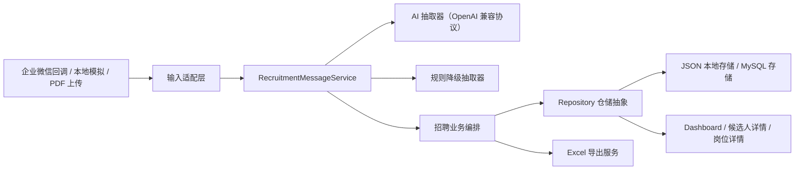

# 企业微信招聘 AI 助手 Demo

这是一个面向招聘协作场景的全链路 AI Demo：从企业微信群消息接入开始，经过企业微信回调验签解密、招聘任务识别、AI 信息抽取、规则降级、候选人入库、岗位进度统计，最终在 Web 看板中展示候选人状态、风险提示、岗位进展和 Excel 报表导出。

我做这个项目的重点不是“跑通一个聊天接口”，而是把真实业务里的输入接入、业务编排、AI 能力、数据存储、异常兜底和测试验证拆开设计，让它具备继续扩展成产品原型的基础。

## 项目亮点

- 真实业务链路：支持企业微信智能机器人回调，不只是本地表单模拟。
- 架构解耦：输入适配、业务服务、AI 抽取、仓储实现、文档解析、报表导出分层清晰。
- AI 可替换：AI 抽取使用 OpenAI 兼容协议，可切换 DeepSeek 或其他兼容模型。
- 规则可兜底：AI 调用失败或结果不稳定时，自动降级为规则解析，保证招聘消息不会直接丢失。
- 招聘流程完整：覆盖候选人录入、简历解析、面试反馈、岗位需求、岗位进度查询、JD 草稿和待确认任务。
- 演示可落地：提供 Web 看板、本地模拟脚本、企业微信真实联调说明、PDF 解析和 Excel 导出。
- 测试可运行：核心模块有 Vitest 单元测试和路由测试，并提供多组业务冒烟测试脚本。

## 业务能力

### 企业微信消息接入

- `GET /api/wecom/aibot/callback`：企业微信 URL 校验。
- `POST /api/wecom/aibot/callback`：接收企业微信加密回调消息。
- 支持文本消息和 PDF 文件消息进入统一招聘处理链路。
- 支持本地模拟消息，方便没有企业微信环境时演示。

### 招聘任务识别

系统会先判断消息属于哪类招聘任务，再进入对应处理链路：

- `resume_parse_match`：简历解析、候选人录入和岗位匹配。
- `interview_feedback`：面试反馈记录、候选人阶段更新。
- `candidate_query`：候选人进度查询。
- `job_requirement`：岗位需求录入或补充。
- `job_progress_query`：岗位招聘进度查询。
- `jd_generate`：基于岗位信息生成 JD 草稿。
- `schedule_update`：面试日程更新。
- `followup_reminder`：跟进提醒。
- `unknown`：无法确认时进入待人工确认任务。

### Web 看板

- 群消息流：展示原始输入、解析状态和系统回复。
- 候选人看板：按招聘阶段展示候选人流转。
- AI 摘要：展示候选人画像、匹配分、风险点和下一步动作。
- 岗位进展：展示目标人数、有效候选人、Offer、重点候选人和风险候选人。
- Excel 导出：导出岗位招聘进度报表。

### PDF 简历解析

- 支持 Web 上传 PDF 简历并解析文本。
- 支持企业微信文件消息下载后进入简历解析链路。
- 解析结果复用候选人入库、岗位匹配和风险识别流程。

## 架构设计

整体设计遵循“输入适配层 -> 业务服务层 -> 能力组件层 -> 仓储层 -> 展示层”的分层方式。这样做的目的，是让消息来源、模型供应商、存储实现和展示方式都可以独立替换。



### 关键设计点

- `WeComBotAdapter` 只负责企业微信协议层，包括验签、解密、消息适配和回复加密。
- `RecruitmentMessageService` 负责招聘业务编排，不直接依赖 HTTP 或企业微信协议。
- `AiExtractor` 负责 AI 信息抽取，并内置规则降级逻辑。
- `CandidateRepository` 是仓储抽象，当前支持本地 JSON 和 MySQL 两种实现。
- `PdfTextExtractor`、`ExcelExportService` 是独立能力组件，方便后续替换实现。

## 目录结构

```text
src/
  client/                 前端页面与样式
  server/
    ai/                   AI 抽取与规则降级
    documents/            PDF 文本提取
    repositories/         仓储抽象与 JSON / MySQL 实现
    services/             招聘业务服务与 Excel 导出服务
    wecom/                企业微信验签、解密、媒体下载
    routes.ts             HTTP 路由
    index.ts              应用装配入口
  shared/                 前后端共享类型
scripts/                  冒烟测试、本地模拟、数据库迁移脚本
docs/                     企业微信真实联调等补充文档
```

## 技术栈

- 前端：React 18、Vite、TypeScript
- 后端：Express、TypeScript
- AI 接口：OpenAI 兼容协议
- 数据存储：本地 JSON，可切换 MySQL
- 文件解析：`pdf-parse`
- 报表导出：`exceljs`
- 测试框架：Vitest

## 快速启动

### 环境要求

- Node.js 18+
- npm 9+

### 安装依赖

```bash
npm install
```

### 配置环境变量

```bash
copy .env.example .env
```

本地演示可以先使用默认 JSON 存储。如果需要接入真实企业微信或真实 AI 服务，再补充 `.env` 中的企业微信参数和模型密钥。

### 启动开发环境

```bash
npm run dev
```

启动后访问：

- 前端：[http://localhost:5173](http://localhost:5173)
- 后端健康检查：[http://localhost:3001/api/health](http://localhost:3001/api/health)

## 演示方式

### 方式一：Web 页面本地演示

1. 执行 `npm run dev`。
2. 在页面左侧发送模拟群消息。
3. 观察消息流、候选人看板、岗位进展和 AI 摘要联动变化。
4. 上传 PDF 简历，展示简历解析和候选人入库。
5. 在岗位详情中下载 Excel 报表。

### 方式二：命令行模拟消息

录入候选人：

```bash
npm run simulate -- "@招聘助手 张三 Java后端候选人，明天下午 3 点一面，王工跟进，手机号 13800138000"
```

录入岗位需求：

```bash
npm run simulate -- "@招聘助手 Java后端岗位招 3 人，要求 3 年以上经验，熟悉 Spring Boot 和微服务，王工负责"
```

查询岗位进展：

```bash
npm run simulate -- "@招聘助手 Java后端现在招得怎么样了？"
```

### 方式三：企业微信真实联调

企业微信真实回调说明见 [docs/wecom-real-callback.md](docs/wecom-real-callback.md)。

核心步骤：

1. 配置 `.env` 中的 `WECOM_BOT_TOKEN`、`WECOM_BOT_ENCODING_AES_KEY`、`WECOM_BOT_RECEIVE_ID`。
2. 执行 `npm run dev:server` 启动后端。
3. 使用内网穿透暴露本地 `3001` 端口。
4. 在企业微信后台配置回调地址：

```text
https://你的公网域名/api/wecom/aibot/callback
```

## API 概览

### 回调与演示

- `GET /api/wecom/aibot/callback`：企业微信 URL 校验。
- `POST /api/wecom/aibot/callback`：接收企业微信加密消息。
- `POST /api/messages/simulate`：模拟一条群消息。
- `POST /api/messages/upload-pdf`：上传 PDF 简历。
- `DELETE /api/demo-data`：清空演示数据。

### 候选人与看板

- `GET /api/messages`：消息记录。
- `GET /api/candidates`：候选人列表。
- `GET /api/candidates/:id`：候选人详情。
- `PATCH /api/candidates/:id/stage`：手动调整招聘阶段。
- `GET /api/dashboard/metrics`：看板指标。

### 岗位与导出

- `GET /api/jobs`：岗位列表。
- `POST /api/jobs`：创建岗位需求。
- `GET /api/jobs/:id`：岗位详情与进度。
- `PATCH /api/jobs/:id`：更新岗位需求。
- `POST /api/jobs/:id/generate-jd`：生成 JD 草稿。
- `GET /api/jobs/:id/export.xlsx`：导出岗位进展 Excel。

### 待确认任务

- `GET /api/pending-tasks`：查看待确认任务。
- `POST /api/pending-tasks/:id/resolve`：确认待处理任务。

## 测试与验证

项目提供了从单元测试、类型检查、构建验证到业务冒烟测试的多层验证手段。

### 单元测试与接口测试

```bash
npm test
```

覆盖范围包括：

- 企业微信签名校验。
- 企业微信 AES-CBC 加解密。
- AI 抽取与规则降级。
- 招聘消息业务编排。
- 主要 HTTP 路由行为。

### 类型检查

```bash
npm run typecheck
```

### 构建验证

```bash
npm run build
```

### 业务冒烟测试

```bash
npm run smoke:recruitment-flow
npm run smoke:recruitment-negative
npm run smoke:pdf-e2e
npm run smoke:wecom-callback
```

如果配置了真实模型或 MySQL，还可以执行：

```bash
npm run smoke:deepseek
npm run smoke:mysql
```

## 可扩展方向

- 新增消息来源：钉钉、飞书、邮件、表单。
- 新增存储实现：PostgreSQL、MongoDB、对象存储。
- 新增 AI 能力：OCR、图片简历识别、语音转写、多轮澄清。
- 新增招聘工作流：Offer 审批、入职跟进、人才库召回。
- 新增产品能力：鉴权、多租户、操作审计、数据权限。

## 面试官可以重点关注

- 这个项目把企业微信协议、招聘业务和 AI 抽取解耦，避免把所有逻辑堆在接口或 prompt 里。
- AI 能力不是唯一依赖，规则降级和待人工确认保证了异常情况下的可用性。
- 数据层有仓储抽象，当前可以本地 JSON 演示，也可以切换到 MySQL。
- 不仅有页面展示，也有测试、构建、模拟脚本、真实联调文档和导出能力。

## 说明

- 仓库默认忽略 `.env`、本地数据、日志和构建产物，避免提交本地运行产生的临时内容。
- `.env.example` 只保留配置模板，不包含真实密钥。
