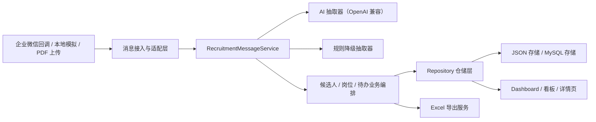

# 企业微信招聘 AI 助手 Demo

一个面向面试展示的全链路招聘协作 Demo：从企业微信群消息接入开始，经过消息验签解密、任务识别、AI 信息抽取、候选人入库、岗位进度统计，最终在 Web 看板中展示候选人状态、风险提示、岗位进展和 Excel 导出结果。

这个项目的目标不是做一个“只能跑通单个接口”的样例，而是展示我对真实业务流程、可扩展架构设计、降级策略、测试保障和交付可用性的理解。

## 项目亮点

- 真实业务链路：支持企业微信智能机器人回调接入，而不是只做本地表单 Demo。
- AI 与规则协同：优先走大模型抽取，失败时自动降级为规则解析，保证消息不丢。
- 面向招聘场景：支持候选人录入、面试反馈、岗位需求录入、岗位进度查询、JD 草稿生成。
- 可视化展示完整：提供消息流、候选人看板、AI 摘要、岗位进展、Excel 导出。
- 架构解耦：消息接入、解析、业务服务、仓储、文档解析、导出能力分层清晰，便于后续替换数据源或模型能力。
- 测试可运行：核心模块带单元测试与接口测试，构建可通过，适合面试现场演示。

## 适合给面试官看的点

- 我如何把“企业微信群消息”抽象成统一消息输入，再交给业务服务处理。
- 我如何将 AI 能力放在可替换的位置，而不是把业务逻辑直接写死在 prompt 里。
- 我如何给招聘场景补上规则降级、手动确认、风险候选人识别等真实业务细节。
- 我如何保证这个 Demo 不只是页面效果，而是具备测试、构建、模拟演示和部署基础。

## 核心能力

### 1. 企业微信群消息接入

- 支持企业微信回调 `GET /api/wecom/aibot/callback`
- 支持企业微信加密消息接收 `POST /api/wecom/aibot/callback`
- 支持本地模拟消息输入，便于无企业微信环境时演示

### 2. 招聘任务识别

系统会先判断消息属于哪类任务，再进入对应处理链路：

- `resume_parse_match`：简历解析与候选人录入
- `interview_feedback`：面试反馈记录与阶段更新
- `candidate_query`：候选人进度查询
- `job_requirement`：岗位需求录入或补充
- `job_progress_query`：岗位招聘进展查询
- `jd_generate`：基于岗位信息生成 JD 草稿
- `schedule_update`：面试日程更新
- `followup_reminder`：跟进提醒
- `unknown`：无法确定时进入待确认任务

### 3. Web 可视化看板

- 群消息流：展示原始输入与 AI 回复
- 候选人看板：按阶段展示招聘进度
- AI 摘要面板：展示候选人画像、匹配分、风险点、下一步动作
- 岗位进度面板：展示岗位目标人数、有效候选人、Offer、风险候选人
- Excel 导出：导出岗位进展报表

### 4. PDF 简历解析

- 支持 Web 上传 PDF 简历
- 支持企业微信文件消息下载后进入简历解析链路
- 提取文本后统一复用候选人入库流程

## 系统架构

整体设计遵循“输入适配层 -> 业务服务层 -> 能力组件层 -> 仓储层 -> 展示层”的解耦方式，方便后续扩展更多消息来源、更多模型供应商和更多存储实现。



## 目录结构

```text
src/
  client/                 前端页面与样式
  server/
    ai/                   AI 抽取与规则降级
    documents/            PDF 文本提取
    repositories/         仓储抽象与实现
    services/             招聘业务服务与导出服务
    wecom/                企业微信验签、解密、媒体下载
    routes.ts             HTTP 路由
    index.ts              应用装配入口
  shared/                 前后端共享类型
scripts/                  冒烟测试与本地模拟脚本
docs/                     补充说明文档
```

## 技术栈

- 前端：React 18、Vite、TypeScript
- 后端：Express、TypeScript
- AI 接口：OpenAI 兼容协议
- 数据存储：本地 JSON，支持切换到 MySQL
- 文件处理：`pdf-parse`
- 导出：`exceljs`
- 测试：Vitest

## 快速启动

### 环境要求

- Node.js 18+
- npm 9+

### 安装依赖

```bash
npm install
```

### 启动开发环境

```bash
npm run dev
```

启动后访问：

- 前端：[http://localhost:5173](http://localhost:5173)
- 后端：[http://localhost:3001/api/health](http://localhost:3001/api/health)

## 演示方式

### 方式一：纯本地演示

适合没有企业微信环境时给面试官快速展示。

1. 启动项目：`npm run dev`
2. 在 Web 页面左侧直接发送模拟群消息
3. 查看候选人看板、岗位进展、AI 摘要联动变化
4. 上传 PDF 简历，展示简历解析与候选人入库
5. 点击岗位详情中的 Excel 下载链接，展示导出结果

### 方式二：命令行模拟消息

```bash
npm run simulate -- "@招聘助手 张三 Java后端候选人，明天下午 3 点一面，王工跟进，手机号 13800138000"
```

也可以演示岗位需求和岗位进度查询：

```bash
npm run simulate -- "@招聘助手 Java后端岗位招 3 人，要求 3 年以上经验，熟悉 Spring Boot 和微服务，王工负责"
npm run simulate -- "@招聘助手 Java后端现在招得怎么样了？"
```

### 方式三：企业微信真实联调

详细说明见 [docs/wecom-real-callback.md](/D:/Project/CodexProject/面试/docs/wecom-real-callback.md)。

基础步骤如下：

1. 复制环境变量模板

```bash
copy .env.example .env
```

2. 配置企业微信机器人信息和 AI 密钥
3. 通过内网穿透暴露本地服务
4. 将企业微信回调地址配置为：

```text
https://你的域名/api/wecom/aibot/callback
```

## 环境变量说明

可参考 [.env.example](/D:/Project/CodexProject/面试/.env.example)。

常用字段如下：

```env
WECOM_BOT_TOKEN=
WECOM_BOT_ENCODING_AES_KEY=
WECOM_BOT_RECEIVE_ID=
WECOM_REPLY_ENABLED=true

WECOM_CORP_ID=
WECOM_APP_SECRET=

OPENAI_BASE_URL=https://api.deepseek.com
OPENAI_API_KEY=
AI_MODEL=deepseek-v4-flash
```

## API 概览

### 回调与演示

- `GET /api/wecom/aibot/callback`：企业微信 URL 校验
- `POST /api/wecom/aibot/callback`：接收企业微信加密消息
- `POST /api/messages/simulate`：模拟一条群消息
- `POST /api/messages/upload-pdf`：上传 PDF 简历
- `DELETE /api/demo-data`：清空演示数据

### 候选人与看板

- `GET /api/messages`：消息记录
- `GET /api/candidates`：候选人列表
- `GET /api/candidates/:id`：候选人详情
- `PATCH /api/candidates/:id/stage`：手动调整招聘阶段
- `GET /api/dashboard/metrics`：看板指标

### 岗位与导出

- `GET /api/jobs`：岗位列表
- `POST /api/jobs`：创建岗位需求
- `GET /api/jobs/:id`：岗位详情与进度
- `PATCH /api/jobs/:id`：更新岗位需求
- `POST /api/jobs/:id/generate-jd`：生成 JD 草稿
- `GET /api/jobs/:id/export.xlsx`：导出岗位进展 Excel

### 待确认任务

- `GET /api/pending-tasks`：查看待确认任务
- `POST /api/pending-tasks/:id/resolve`：确认待处理任务

## 测试与验证

项目要求每个模块都要有可运行的验证手段，这里已经整理成可直接展示给面试官的测试入口。

### 1. 单元与接口测试

```bash
npm test
```

本地验证结果：

- 4 个测试文件通过
- 28 个测试用例通过

覆盖点包括：

- 企业微信签名校验
- 企业微信 AES-CBC 加解密
- AI 抽取与规则降级
- 招聘消息业务编排
- 主要路由行为验证

### 2. 构建验证

```bash
npm run build
```

本地验证结果：通过，可正常生成前端构建产物。

### 3. 类型检查

```bash
npm run typecheck
```

### 4. 业务冒烟测试

项目内已经准备了一组脚本，可以作为“测试手段”直接展示：

```bash
npm run smoke:deepseek
npm run smoke:recruitment-flow
npm run smoke:recruitment-negative
npm run smoke:mysql
npm run smoke:pdf-e2e
npm run smoke:wecom-callback
```

### 5. 手工演示检查清单

建议每次对外展示前至少跑一遍：

1. `npm test`
2. `npm run build`
3. `npm run dev`
4. 发送一条模拟候选人录入消息
5. 发送一条面试反馈消息
6. 新建一个岗位并查看岗位详情
7. 上传一份 PDF 简历
8. 下载一次 Excel 报表

## 为面试展示建议补充的截图

建议你在 GitHub README 或仓库 `docs/` 下补这几张截图，效果会明显更好：

1. 首页总览截图
说明：展示顶部指标卡、群消息流、候选人看板、AI 摘要三栏布局。

2. 候选人详情截图
说明：展示简历画像、匹配分、风险点、下一步动作、时间线。

3. 岗位进度截图
说明：展示岗位目标人数、有效候选人、Offer、重点候选人、风险候选人。

4. PDF 简历上传截图
说明：展示上传入口与解析后数据联动结果。

5. Excel 导出结果截图
说明：展示不是“只能看不能导”，而是具备报表交付能力。

6. 企业微信真实回调配置截图
说明：如果方便脱敏，补一张企业微信后台回调配置页，会非常加分。

7. 测试通过截图
说明：终端中 `npm test` 和 `npm run build` 通过的结果，能体现工程质量。

## GitHub 展示建议

为了让仓库更适合面试官阅读，建议仓库首页至少具备这些元素：

- 一段 3 行以内的项目定位说明
- 1 张整体界面截图
- 1 张系统架构图
- 1 段“我解决了什么业务问题”
- 1 段“可运行、可测试、可扩展”的说明
- 清晰的启动步骤和测试命令

如果你愿意进一步增强展示效果，可以再补：

- `docs/demo-script.md`：面试时的 3 分钟演示话术
- `docs/screenshots/`：统一存放截图
- `docs/architecture.png`：导出的架构图

## 后续可扩展方向

这个项目已经做了基础解耦，后续可以比较平滑地扩展：

- 新增消息来源：钉钉、飞书、邮件、表单
- 新增存储实现：PostgreSQL、MongoDB
- 新增能力组件：OCR、图片简历识别、语音转写
- 新增工作流：Offer 审批、入职跟进、人才库召回
- 新增鉴权与多租户支持，进一步产品化

## 说明

- 仓库默认忽略本地日志、构建产物、环境变量和本地数据文件，适合公开展示。
- 如果你准备公开到 GitHub，记得确认 `.env` 中不包含真实密钥。
- 如果要给面试官在线演示，建议提前准备一份固定的 PDF 简历样本和一组演示消息。
